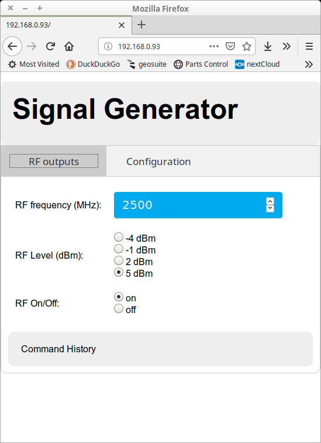

## RF Signal Generator (YSG)
A signal generator that integrates with the YView network although it will run autonomously.

## Features
 * Provides a signal from 137.5 MHz to 4400 MHz.
 * Powered from a micro USB connector.
 * Connects to a WiFi network.
 * Presents a web interface.
 * The YSG command line tool allows the device to be included in
automated test environment.

## Web Interface
The web interface show a web page with to tabs

### RF outputs Tab
This tab allows the user to set

* Set the output frequency
* Set the output level
* Turn the output on and off

### Configuration Tab
This tab allows the user to set

* The device name (this appears at the top of the web page).
* The group name. This is a YView network function (see [YView GUI](https://github.com/pjaos/yview/tree/master/gui/java)) for more details. If the device is not in a YView network then this option can be left blank.
* Enable syslog. Syslog output is sent to the ICONS GW server (See https://github.com/pjaos/yview/tree/master/icons_gw) for more details. If the device is not in a YView network then this option can be left unselected.

# Hardware
Once the electronics and software was complete I designed and 3D printed an ABS case as shown in the following pictures of the finished product.

The 3D printed case included light pipes to bring out the LED's. The Red LED indicates power to the device. The Blue LED indicates the WiFi is connected. The hole nearest the LED's can be used to  reset the device. The hole furthest from the LED's can be used to setup the WiFi on the device if held down for 5 seconds.

A nodeMCU ESP 32 board provides WiFi connectivity.

An ADF4350 development board was connected to the above board via an SPI bus.

The schematic folder contains the Kicad schematic of the connections between the above modules. Click  for a PDF of the schematic.

## Software
The device software is written in C ([here](mgos)). As part of this project I wrote the [ADF4350 device driver](https://github.com/pjaos/adf4350) from scratch.
The software makes extensive use of [Mongoose OS](https://mongoose-os.com/). Mongoose OS was chosen because as it provides many features (on top of the FreeRTOS SDK from [Esspessif](https://www.espressif.com/en/products/software/esp-sdk/overview) ) which allows faster product development.
